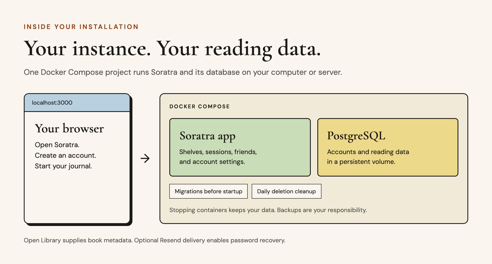

# Soratra

>*Soratra* means **"writing"** in Malagasy.

[Get started](#run-it) · [Configuration](#what-you-need-to-configure) · [Self-hosting guide](docs/SELF_HOSTING.md) · [Contributing](CONTRIBUTING.md) · [License](#license-and-attribution)

Soratra is a reading journal for yourself and a small circle of friends. Run your own instance to keep shelves, record daily reading, and share your shelves and journal with accepted friends.

The original hosted service has shut down. This repository is the self-hosted version of Soratra. You run the application and own its database. Maintenance is occasional; there is no support or availability guarantee.

## What it does


- Shelves for books you want to read, are reading, and have read, with ratings, reviews, and finish dates.
- Daily reading sessions with minutes, ratings, notes, and spoiler controls.
- A journal, reading heatmap, time-zone-aware streaks, and a weekly streak freeze.
- Exact-username friend discovery and mutual connections. Removing a friendship removes shared access.
- Account export, password changes, password recovery when email is configured, and account deletion.

Book search and metadata come from Open Library. Search and cover loading need internet access. Saved reading data lives in your PostgreSQL database. There is no import tool, native desktop/mobile app, offline book catalog, or billing integration.

## Run it

Install Docker Desktop or Docker Engine with Compose v2 and start Docker. On macOS or Linux, clone the repository and enter its folder:

```sh
git clone https://github.com/KadirKess/Soratra.git
cd Soratra
```

You can also download a ZIP, extract it, and open a terminal in the extracted folder. Start your instance:

```sh
./soratra.sh
```

The first launch asks for a local port, generates private credentials in `.env`, builds the application, applies database migrations, and starts Soratra and PostgreSQL. The first build can take several minutes. Open the address it prints and create an account. Run the same command again to launch it. You do not need Node.js installed on your computer.

The launcher is a Bash script. On Windows, use a WSL2 Linux terminal with Docker Desktop's WSL integration enabled. Startup shows compact progress steps; use `--verbose` for Docker output if you need to investigate a failure.

```sh
./soratra.sh configure       # Edit the saved local port
./soratra.sh advanced        # Email recovery, public hosting, and more
./soratra.sh --port 3030     # Change the port and launch
./soratra.sh stop            # Stop without removing your reading data
./soratra.sh --help          # All commands and options
```

Docker Compose is the recommended installation. It runs the app, PostgreSQL, migrations, and daily cleanup. See [self-hosting instructions](docs/SELF_HOSTING.md) for local installation, HTTPS hosting, backups, and upgrades.



The default installation listens on localhost. A shared instance needs HTTPS, its own operator/contact details, and a verified Resend email sender. Each installation has its own accounts and friendships; separate instances do not connect to one another.

## What you need to configure

For a personal installation on this computer, the launcher supplies the necessary settings. You do not need a domain, an email account for the app, or an Open Library API key. Password recovery is unavailable while email is disabled, so retain your sign-in credentials.

Use `./soratra.sh advanced` to configure email or a shared instance. It validates settings before saving them. After saving, run `./soratra.sh` to apply the changes. The settings below live in `.env`; `.env.example` documents the available keys and is not a working installation configuration.

| Settings | Personal installation | Shared instance on the internet |
| --- | --- | --- |
| `APP_PORT` | Defaults to `3000`; choose another free port if needed. | The app's local port behind the HTTPS proxy. |
| `SITE_URL`, `AUTH_URL` | The same localhost origin; the launcher updates both when you change ports. | Your exact HTTPS origin in both fields, such as `https://reading.your-domain.tld`. |
| `DEPLOYMENT_MODE` | `local`. | `public`. |
| `LEGAL_NAME`, `SUPPORT_EMAIL` | Personal operator name; a contact address is optional. | Your own name or organization and a real support address, shown on legal and support pages. |
| `EMAIL_MODE` | `disabled`, or `resend` if you want password recovery. | `resend` is required. |
| `EMAIL_FROM`, `RESEND_API_KEY` | Leave blank when email is disabled. | A sender verified in your own Resend account and that account's API key. A support address alone does not enable delivery. |
| `PUBLIC_HOST` | Leave blank. | Your hostname without `https://` or a path, for the supplied Caddy proxy. DNS must point to your server; ports 80 and 443 must be available. |
| `PUBLIC_DEPLOYMENT` | `preview` keeps public pages out of search results. | Use `production` if you want the public pages indexed. Authenticated pages remain private. |
| `TRUSTED_PROXY_IP_HEADER` | Leave blank; forwarding headers are ignored. | The supplied Caddy overlay uses `x-real-ip`. Only trust a header your proxy overwrites, and restrict direct app access. |
| `SECURITY_CONTACT`, `SECURITY_EXPIRES` | Optional. | Set a `mailto:` or HTTPS reporting contact and a future ISO expiry date to publish `security.txt`; renew before it expires. |
| `SOURCE_CODE_URL` | Leave blank to serve the bundled source archive. | The bundled archive also works here. An override must point to the corresponding source for your running version. |

Addresses containing `example.com` or `.example` are placeholders, not working support or sender addresses. Replace illustrative domains and contact details with your own before inviting readers. Public mode rejects missing or placeholder operator/email settings and requires HTTPS and Resend. Review the legal and privacy text for your actual hosting and backup policy.

The launcher generates `POSTGRES_PASSWORD`, `AUTH_SECRET`, and `CRON_SECRET`. Keep them private. Compose supplies the internal database connection; `POSTGRES_URL` is also used by host-side development tools. `POSTGRES_POOL_MAX` defaults to five connections. Changing the environment file's database password does not change a password in an existing database.

Your reading data stays in a Docker volume when you stop Soratra. Keep a protected copy of `.env` and make database backups before upgrades. See [backups and restore](docs/SELF_HOSTING.md#backups-and-restore) and [upgrades](docs/SELF_HOSTING.md#upgrades) for the commands. There is no automatic backup service.

## Development

See [CONTRIBUTING.md](CONTRIBUTING.md) for setup, Docker integration tests, and contribution guidelines.

Use Node.js 24 LTS, npm, and Docker Compose. The [contributor setup](docs/SELF_HOSTING.md#contributor-setup) starts PostgreSQL in Docker and runs Next.js locally.

The app uses Next.js App Router, React, tRPC, Drizzle, PostgreSQL, Auth.js, and Tailwind CSS. Fonts are bundled locally. There are no third-party analytics or advertising scripts. Operational logging and limited first-party web-vital collection are part of the application.

Useful checks:

```sh
npx tsc --noEmit
npm test
npm run test:setup
npm run build
npm audit --omit=dev --audit-level=high
```

Playwright requires a separate test database. See the guide before running it.

The README figures use the application's bundled fonts and palette. To regenerate them, install Playwright's Chromium and run `node scripts/render-readme.mjs`. Their editable layout is in [docs/readme-figures.html](docs/readme-figures.html).

The [GitHub Actions workflow](.github/workflows/ci.yml) is configured to run the checks above. Its Docker job builds this repository, starts PostgreSQL and the app in an isolated Compose project, checks migrations twice, verifies health and the downloadable source archive, and runs Chromium browser tests against that app. Book metadata comes from a local test fixture. CI creates disposable test accounts and needs no hosted-service credentials. A passing run verifies these workflows; it does not test your domain, TLS certificates, or real Resend delivery.

## License and attribution

Application code is licensed under [GNU AGPLv3](LICENSE). Commercial use is allowed under that license. Keep the required copyright and license notices and Soratra attribution. If you modify the app and let people use it over a network, AGPLv3 requires offering those users the corresponding source for your modified version. Distribution also carries source obligations; consult the license for the full terms.

The Soratra name and logo have a separate [branding policy](TRADEMARKS.md). See [NOTICE](NOTICE) for attribution and [font notices](LICENSES/README.md) for the bundled fonts, which retain their own licenses.
